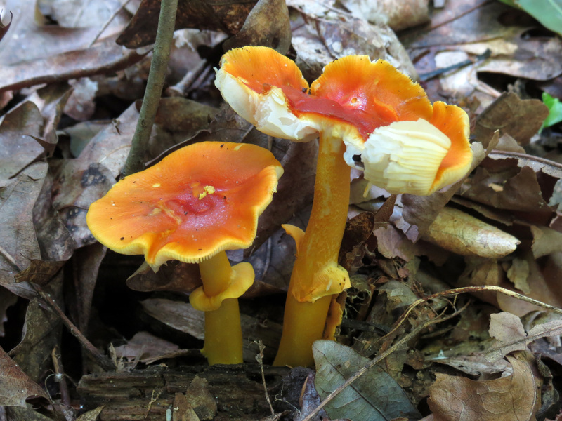

# Apprentissage par transfert pour la classification d'images

Code pour le projet d'INF8225

Nous comparons ici les performances de ResNet et Inception v3 sur deux datasets, avec apprentissage par transfert et augmentation de données.

iNaturalist, super-catégorie Fungi      |  Oxford 102 Flowers
:-------------------------:|:-------------------------:
  |  


## Données

Deux datasets sont utilisés dans ce projet. Ils doivent se trouver tous les deux dans le dossier **data**.

- [Oxford 102 Flower (102 Category Flower Dataset)](https://www.robots.ox.ac.uk/~vgg/data/flowers/102/): Dataset de classification d'image comportant 102 catégories de fleurs communes au Royaume-Uni, avec entr 40 et 258 instances par classe.
Chemin des images **data/Flowers/jpg/**
- [iNaturalist](https://github.com/visipedia/inat_comp/tree/master/2017): Dataset de classification d'image du vivant comportant plus de 600 000 exemples d'entraînement. On n'utilisera ici que la super-catégorie des champignons (Fungi). Il n'est pas possible de la télécharger séparement des autres. Le dataset entier fait 186GB. 
Chemin des images **data/iNaturalist/train_val_images/Fungi/**

Des exemples à des fins de démonstration sont présent dans le dossier **data/examples** .

## Installation

``` 
pip install -r requirements.txt
```

Si les datasets doivent être téléchargés

```
cd src
. data_preparation.sh
```
